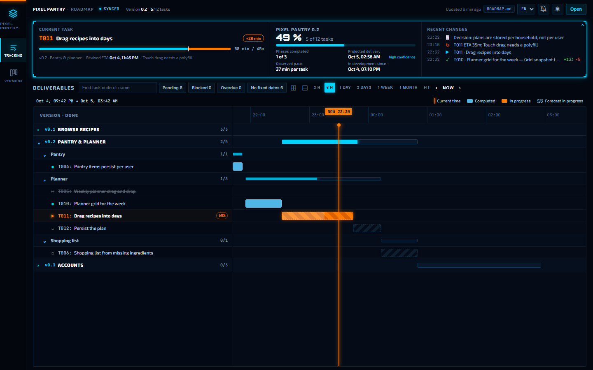
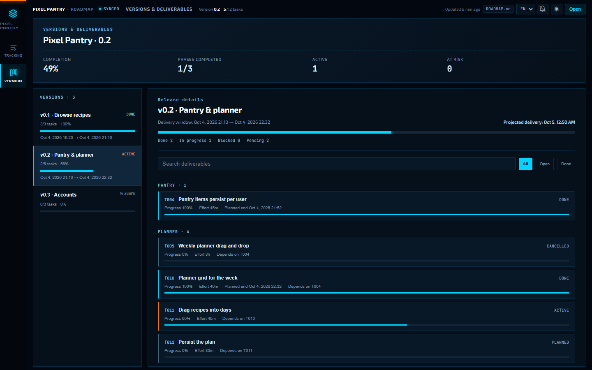
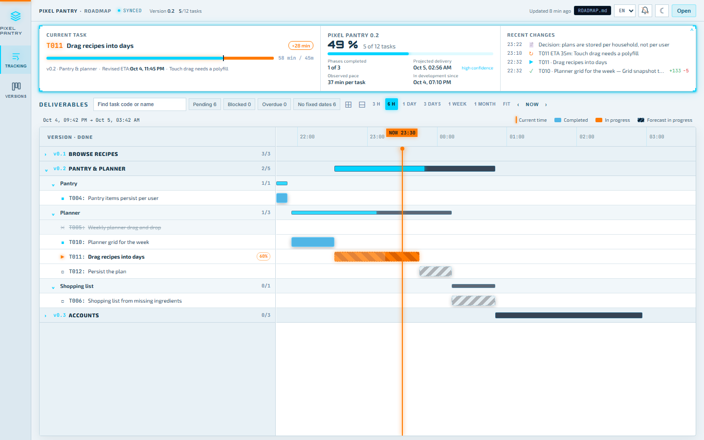

<!-- markdownlint-disable MD033 MD041 -->
<p align="center">
  
</p>

<h1 align="center">Visual Roadmap</h1>

<p align="center">
  <b>See what your coding agent is doing, how far along it is, and when it will be done.</b><br/>
  A Markdown file in your repo, a live timeline in your browser.
</p>

<p align="center">
  <a href="https://github.com/DesvoSoft/visual-roadmap/actions/workflows/ci.yml"></a>
  <a href="https://github.com/DesvoSoft/visual-roadmap/releases"></a>
  
  
  <a href="LICENSE"></a>
</p>

<p align="center">
  
</p>

You hand a feature to Claude Code, Codex or Cursor and switch to something else. Twenty minutes later you have no idea whether it is nearly done, stuck on a failing test, or three tasks ahead of where you thought.

Visual Roadmap fixes that with one habit: the agent runs a one-line command whenever its state changes. Everything else — clocks, ETAs, forecasts, lines changed, what comes next — is worked out for it.

```text
$ npx visual-roadmap add "Search filters recipes by ingredient" --effort 40m
✓  T002 added
$ npx visual-roadmap start T002
✓  T002 started
$ npx visual-roadmap done T002 --note "6 search tests green" --next
✓  T002 done · real 48m · +142 -30 · now T003
```

That is the agent's whole side of it. Yours is the screenshot above, updating as it happens.

- **Nothing to sign up for.** No account and no backend: the server runs on your machine. `ROADMAP.md` is a plain file you own and can edit by hand.
- **Nothing to install besides itself.** Zero runtime dependencies; the viewer is a single HTML file.
- **Cheap for the agent.** Every command answers in one line, and the protocol it reads is under a thousand words.

## Quick start

You need Node.js 18+. Git is optional, and adds commit links and line counts.

**1. Add it to the project you want to track**

```bash
npm install --save-dev github:DesvoSoft/visual-roadmap
```

<details>
<summary>pnpm · bun · pinning a version</summary>

```bash
pnpm add -D github:DesvoSoft/visual-roadmap      # add -w at a workspace root
bun add -d github:DesvoSoft/visual-roadmap
```

Append a tag to pin a release: `github:DesvoSoft/visual-roadmap#v0.6.0`.

Use the package manager the project already uses. Running `npm install` in a pnpm project fails with errors that look like a broken lockfile.

</details>

**2. Set it up and open the viewer**

```bash
npx visual-roadmap init --project "My App"
npx visual-roadmap live
```

`init` writes `ROADMAP.md`, the agent instructions and, for Claude Code, the hooks. It does not overwrite files you already have. `live` opens `http://127.0.0.1:3579` and follows the file from then on.

**3. Tell your agent once**

> Follow the visual-roadmap protocol. Split what is left in this project into releases and verifiable tasks, then work task by task.

From here on, new requests are planned and tracked the same way without you asking.

<details>
<summary>Or let the agent do all three steps</summary>

Paste this into any agent that has a shell:

> Install visual-roadmap in this project with the package manager it already uses (`github:DesvoSoft/visual-roadmap` as a dev dependency), then run `npx visual-roadmap init --project "<name>"`. Read the generated skill (`.claude/skills/visual-roadmap/SKILL.md` or `SKILL.md`), plan the remaining work with `npx visual-roadmap add`, and follow the protocol from now on.

</details>

<details>
<summary>What <code>init</code> installs, by agent</summary>

| Your setup | What you get |
| --- | --- |
| **Claude Code** (`CLAUDE.md` or `.claude/` present) | A skill in `.claude/skills/visual-roadmap/`, loaded only when relevant, and hooks in `.claude/settings.json` |
| **Codex, Cursor, Gemini, Copilot…** | `SKILL.md` at the root, or in `.visual-roadmap/` if that name is taken |
| **Every setup** | A three-bullet block in whichever of `CLAUDE.md`, `AGENTS.md`, `GEMINI.md`, `.cursorrules` or `.github/copilot-instructions.md` exist (`AGENTS.md` is created if none do) |

Skip parts with `--no-agents` or `--no-hooks`. `--force` overwrites existing files, `ROADMAP.md` included.

</details>

**Just want to look?** Clone this repository and run `npm run demo`. It plays a scripted agent session through the real CLI in a throwaway project while the viewer updates.

## What you see

<p align="center">
  
  
</p>

**Now.** The task in progress, how long it has taken against what was expected, and an ETA that turns orange when it slips. If the agent revises the ETA, the reason sits next to it. The browser tab reads `▶ T004 · 23 min`, so you can check from another window.

**Next.** A timeline of every deliverable, from a 3-hour window to a month. Projections respect dependencies and are calibrated with how long finished tasks really took, not with how long the agent hoped they would.

**Wrong.** Missing dependencies, two tasks active at once, an ETA nobody updated, a task too big to verify. Each warning opens the task it is about.

**Proof.** Commits that mention a task ID show up on that task. With Claude Code, the screenshots the agent takes to check its own work are kept there too, with a thumbnail on the timeline.

Also in the box: desktop notifications when a task finishes or blocks, a versions view, search and filters, dark and light themes, English and Spanish, and a portable `roadmap.html` that works by double-click, without a server.

## With Claude Code it runs itself

`init` installs four hooks, so the protocol holds even when the agent forgets:

| Hook | What it does |
| --- | --- |
| `SessionStart` | Hands the agent a four-line brief: current task, next ready tasks, anything to fix. |
| `PostToolUse` | Starts the next ready task if the agent begins writing code with nothing active, and keeps its screenshots. Silent otherwise. |
| `Stop` | Holds the agent once if it is about to stop with roadmap errors, a passed ETA or untracked work. |
| `UserPromptSubmit` | Passes the same reminders along with your message. It never blocks your prompt. |

Other agents follow the same protocol from `SKILL.md`; they just are not reminded.

## Commands

The agent's commands edit the nearest `ROADMAP.md` (or `--file`) and answer in one line. You can run them too.

| When | Command |
| --- | --- |
| Resume a session | `status [--json]` |
| Plan a task | `add "Result" --effort 30m [--release "v0.2 · Name"] [--group "Subgroup"] [--after T003]` |
| Start working | `start T004 [--expected 40m]` |
| Verified progress | `progress T004 60` |
| The ETA no longer holds | `eta T004 25m "reason"` |
| Finish | `done T004 --note "evidence" [--next]` |
| Blocked | `block T004 "cause"` |
| Pause and resume | `pause T004 "reason"` · `resume T004` |
| A task grew too big | `split T005 "Part A:30m" "Part B:45m"` |
| Decision or note | `log "text"` |
| Attach a screenshot | `shot [T004] image.png "caption" [--final]` |
| List or prune screenshots | `shots [T004] [--json]` · `shots prune` |
| After editing by hand | `check [--json] [--strict]` |

<details>
<summary>Viewer and setup commands</summary>

| Command | Purpose |
| --- | --- |
| `init --project "Name"` | Create the roadmap, the viewer and the agent setup. |
| `live [--port 3579]` | Serve the viewer, watch `ROADMAP.md` and open the browser. |
| `serve --file path/ROADMAP.md` | Serve without opening the browser. |
| `open` | Open the portable `roadmap.html`. |
| `agents [--install]` | Print or install the block for `CLAUDE.md` / `AGENTS.md`. |
| `hooks [--install]` | Print or install the Claude Code hooks. |

</details>

All of them are run as `npx visual-roadmap <command>`.

## How it works

```text
  agent ── start / done / eta ──►  ROADMAP.md  ──── watch + SSE ────►  viewer
    ▲                                  │
    └──── brief at session start ◄─────┘      (Claude Code hooks)
          check before stopping
```

`ROADMAP.md` is the only source of truth: YAML frontmatter and one Markdown table per release. Commands make small, deterministic text edits and leave your column order, line endings and prose alone. The viewer derives everything that depends on the clock, so the agent never writes just because time passed.

## Updating

Install again with the same command you used, then refresh the agent setup:

```bash
npx visual-roadmap init
```

Your `ROADMAP.md` is left as it is; the skill, the instructions block and the hooks are brought up to date. Release notes are in the [changelog](CHANGELOG.md).

## Troubleshooting

| Symptom | Fix |
| --- | --- |
| `npm install` fails with `ERESOLVE`, "damaged lockfile" or `Cannot destructure property 'package'` | The project uses pnpm or another manager. Install with that one (see Quick start). |
| Port 3579 is taken | `npx visual-roadmap live --port 3580` |
| The agent stopped updating the roadmap | Ask it to run `npx visual-roadmap status`. With Claude Code, reinstall the hooks: `npx visual-roadmap hooks --install`. |
| Codex or Cursor ignores the protocol | `npx visual-roadmap agents --install` puts the block back in `AGENTS.md` / `.cursorrules`. |
| Warnings after editing the file by hand | `npx visual-roadmap check` lists each problem and its fix. |
| `.roadmap/shots/` keeps growing | Set `shots_max_mb` in the frontmatter, or run `npx visual-roadmap shots prune`. |

## Documentation

- [SKILL.md](SKILL.md) — the protocol the agent follows *(Spanish)*
- [ROADMAP format](docs/ROADMAP_FORMAT.md) — the file and its rules *(Spanish)*
- [examples/VOIDFRONT.md](examples/VOIDFRONT.md) — a larger sample roadmap; `npm start` opens it
- [CHANGELOG.md](CHANGELOG.md) — release notes

## Contributing

```bash
npm test               # node:test, no frameworks
npm run build          # rebuild dist/roadmap.html after editing viewer/
npm run demo           # watch a scripted agent session in the live viewer
npm run screenshots    # regenerate the images in this README (needs Edge or Chrome)
```

[AGENTS.md](AGENTS.md) maps where each kind of change goes, and [docs/DEVELOPMENT.md](docs/DEVELOPMENT.md) covers the local workflow *(Spanish)*. Design notes for shipped features are in [docs/design/](docs/design/). Bugs and ideas go in [issues](https://github.com/DesvoSoft/visual-roadmap/issues).

## License

[MIT](LICENSE) © 2026 DesvoSoft
